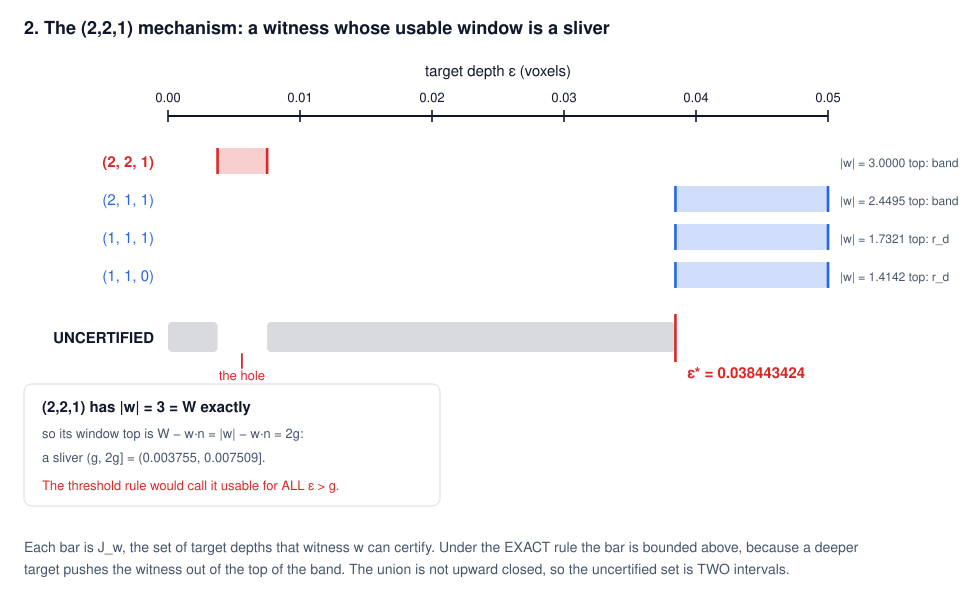
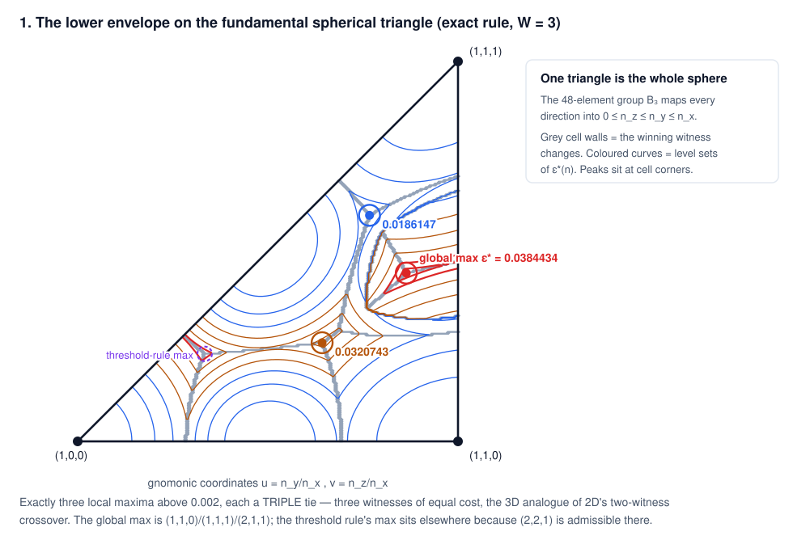
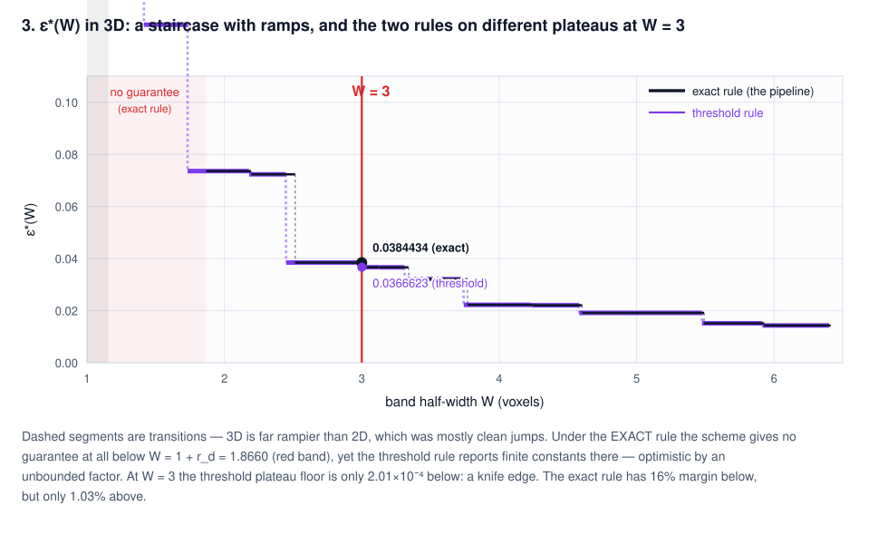
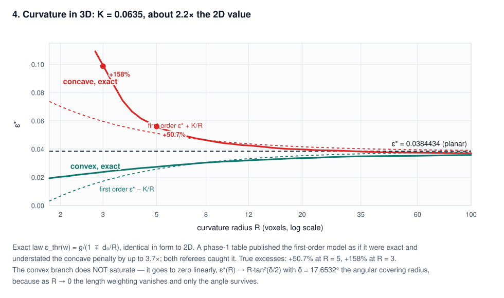

# The same question in 3D: two constants, not one

**What the 2D certification-gap result becomes on `Z³`, and where it stops being the same problem.**

*Efty Sifakis. Working note, branch `new-distancing-approach`. Companion to
`CertificationGap_Note.md`, which should be read first — the setup, the reduction, and the
vocabulary are all established there.*

The full technical document is `LatticeCertificationGap3D.md`; scripts are in
`scripts/distancing_experiments/lattice_gap_3d/`.

---

## 1. The result

In 2D one number answered the question. In 3D there are **two**, because the two admissibility
readings — which agreed in 2D at `W = 3` — come apart:

```
threshold rule    ε*_thr = (3 − √5 − √(4√30 + 2√5 − 26)) / 4
                         = 0.036662265118829642294259933043…
                    n*   = ( (√5−1+β)/2 , (√5−1−β)/2 , √6−√5 ),   β = √(4√30+2√5−26)
                    tie  = (1,0,0), (2,1,0), (2,1,1)

exact rule        ε*_exa = (√2 + √3 − √6 − √(6√2 + 2√6 − 13)) / 2
 (the pipeline)          = 0.038443423574719626566412269573…
                    n*   = ( √6−√3 , √(6√2+2√6−13) , √3−√2 )
                    tie  = (1,1,0), (1,1,1), (2,1,1)
```

Both are algebraic of degree exactly **8**, and irreducibility is **proved** (exact `Fraction`
arithmetic in the field tower, not a numerical screen):

```
threshold:  64x⁸ − 384x⁷ + 1344x⁶ − 2944x⁵ + 4624x⁴ − 5040x³ + 3400x² − 800x + 25
exact:          x⁸        + 2x⁶  +  12x⁵  +   79x⁴ −  228x³ +  474x² − 252x + 9   (monic)
```

Certified brackets from two independent referee methods — a polytope-vertex certificate in exact
rational interval arithmetic, and a rigorous spherical-triangle branch-and-bound:

```
ε*_thr ∈ [0.03666226511880799, 0.03666226511890799]
ε*_exa ∈ [0.03844342357468555, 0.03844342357478556]
```

**The degree obeys a rule.** `deg(ε*) = 2·[Q(|w₁|,…,|w_d|):Q] = 2^(r+1)`, where `r` counts the
independent surds among the tying witnesses' lengths. 2D had `r = 1` → degree 4; both 3D maxima have
`r = 2` → degree 8. It is not an accident of dimension, it is an accident of *which* witnesses tie.

Scale: `ε*_exa / ε*_2D = 2.00198733` — near-2×, and explicitly **not** exactly 2. Enrichment still
reaches `22.5×` deeper than plain connected components, down from `36.8×` in 2D.

---

## 2. Why there are two: the `(2,2,1)` mechanism



To use a witness it must be **in the band**, and its depth `d₀ = ε + w·n` depends on the *target's*
depth. So "which witnesses exist" moves as `ε` moves. The two rules differ only in where you evaluate
that:

- **threshold rule** — at `ε = g(w,n)`, the shallowest depth at which the witness could fire, giving
  the `ε`-free `d₀ = (|w| + w·n)/2`;
- **exact rule** — at the target's actual `ε`.

The threshold rule is what a clean optimisation wants, and its usual justification (*"deeper `ε` only
pushes the witness further from the barrier"*) is **true for the floor and false for the ceiling**.

At `n*_exa` the vector `(2,2,1)` has `|w| = 3 = W` **exactly**:

```
g          = 0.0037546622                        ← 10× cheaper than ε*: it would win outright
d₀_thr     = (|w| + w·n)/2 = 2.996245337821547   ≤ 3  →  ADMISSIBLE  (threshold)
d₀_actual  = ε* + w·n      = 3.030934099217813   >  3  →  EXCLUDED   (exact)
```

That one vector is the entire difference between the two constants. Because `|w| = W`, its usable
window closes at `W − w·n = |w| − w·n = 2g`, so it is live only on the **sliver** `(g, 2g]` and the
uncertified set becomes two intervals:

```
CERTIFIED    (0.003754662, 0.007509324]  ∪  (0.038443424, 0.866025404]
UNCERTIFIED  (0, 0.003754662]            ∪  (0.007509324, 0.038443424]
                                             └────── sup = ε* ──────┘
```

**Upward-closedness genuinely fails in 3D** — the uncovered set is not an interval at **8.45%** of
directions (in 2D: 0 of 90 001). The practical consequence is sharp: *any measurement of `ε*` that
bisects on depth is unsound*, and this actually produced a wrong published endpoint during the work.

---

## 3. Three witnesses tie, not two



`B₃`, the 48-element hyperoctahedral group, reduces `S²` to one spherical triangle
(`n_x ≥ n_y ≥ n_z ≥ 0`, angles 45/60/90°). The lower envelope `min_w g(w,n)` partitions it into cells
by which witness wins; its local maxima sit at cell corners. In 2D a corner joined **two** cells — a
kink. On `S²` a generic corner joins **three**, so the critical configuration is a **triple tie**.

Confirmed: exactly three witnesses tie under both rules, to `5×10⁻¹²¹`, with no fourth within
`10⁻⁶⁰` over `|w|² ≤ 400`. Exactly three local maxima above `0.002` exist on the whole triangle
(branch-and-bound superlevel-set census). The 2D constant `0.0192026` survives in 3D only as a
**saddle** on the mirror face `n_z = 0`.

Both tying triples have `det = ±1`. That looks like a 3D unimodular-triple analogue of the 2D Farey
neighbour structure, but no such theory was attempted — see §7.

**Angles, for calibration.** The worst-case angle to the nearest available primitive direction — the
3D counterpart of 2D's `13.2825°` — is

```
δ = 17.653171084°   at  n = (0.952910, 0.224951, 0.203372)
```

by exhaustive Voronoi-vertex enumeration over all `C(98,3)` direction triples. At the critical
direction the tying witnesses sit at `θ = 18.98°`, `17.14°`, `14.39°` — and there **is** a vector
within `4.05°` of the normal, namely `(2,2,1)`, which the band excludes. As in 2D, the constant is
set by the band amputating the well-aligned vectors, not by how badly the lattice covers directions.

Selecting by *angle* instead of by cost would give `√6·sin²(δ/2) = 0.0576737` against the true
`0.0366623` — a ratio of `1.573`, versus `1.558` in 2D. **The length weighting is worth almost
exactly the same factor in both dimensions.**

---

## 4. The band width



| rule | plateau containing `W = 3` | value |
|---|---|---|
| threshold | `[2.999798995571, 3.125848288596]` | `0.036662265118830` |
| **exact** | `[2.515450323320, 3.030934099218)` | `0.038443423574720` |

```
W_lo' (exact rule) = √3 − 1/2 + (3/2)·√(√3 − 1) = 2.515450323319905583     (degree 4)
W_hi  (threshold)  = (√10 + 2√5 − 2 + β)/2                                  (degree 16)
```

`W_hi` is **literally the 2D formula with `β₂ → β₃`** — the ceiling transferred structurally even
though the constant did not.

Two things are worse than 2D led me to expect:

- **`W = 3` is a knife edge under the threshold rule** — only `2.010×10⁻⁴` above the plateau floor,
  `0.0067%` of `W`. The 2D margin was `0.7639`. Under the exact rule there is `16%` of margin below
  but only `1.03%` above.
- **3D is far rampier.** Over `[0.9, 7.2]` the threshold rule has 3 pure jumps, 10 pure ramps and 2
  mixed; the exact rule 3 jumps, 3 ramps, 4 mixed. 2D was mostly clean jumps. On a ramp the supremum
  is not attained.

**Where there is no guarantee at all:**

```
threshold rule:  ε*(W) = r_d  for  W < 2/√3   = 1.154700538379
exact rule:      ε*(W) = r_d  for  W < 1+r_d = 1.866025403784   (identical in form to 2D)
```

On `[2/√3, 1+r_d)` the threshold rule reports finite constants (`0.577`, `0.354`, `0.130`, `0.0736`)
while the true answer is still *nothing at all*. **For narrow bands the threshold rule is optimistic
by an unbounded factor.**

---

## 5. Curvature



The exact sphere law is **dimension-free** — the centre, target and witness span a 2-plane, so the 2D
derivation applies verbatim:

```
ε_thr(w) = g / (1 ∓ d₀/R)          first order  g + p²/(4R)
```

checked against raw sphere geometry to `2.2×10⁻¹²`. The constant does not transfer:

```
K_thr = 0.060737086295      K_exa = 0.063494643741      (2D: 0.028315226154)
```

**Curvature hurts about 2.2× more in 3D.** True excesses over the planar value, from exact sphere
geometry:

| `R` | `ε*` | excess |
|---|---|---|
| 5 | `0.057951775943` | **+50.7%** |
| 3 | `0.099168924645` | **+158%** |

> A phase-1 track published a finite-`R` table that was actually the second-order paraboloid model
> labelled as exact, understating the concave penalty by up to `3.7×`. Both referees caught it. The
> numbers above come from an evaluator that places a real sphere and never uses the reduced formula.

**The convex branch does not saturate** — the 2D reading was wrong about the mechanism, though right
about the shape. As `R → 0`,

```
c_w = R·g/(R + d₀) → R·tan²(θ_w/2)
```

the **length weighting vanishes and only the angle survives**, so `ε*(R) → R·tan²(δ/2)` — linear to
zero, with `tan²(δ/2) = 0.0241129`. The slope is `2.5×` shallower than `K`, which is exactly why the
exact curve *looks* like a plateau while `ε* − K/R` dives. Both dimensions agree on the ratio at
`R₀ = K/ε*` (2D `0.5051`, 3D `0.5109`).

**Is the concave sphere the worst case?** Proved for `R > W = 3`; high-confidence numerical for
`2.564 < R ≤ 3`; **open** below, and open for general surfaces. The obstruction is real: for a
witness with `|w| = W` exactly — and `(2,2,1)` is one, winning on 14% of solid angle — the cost
`c_H = g(1 − κd₀)` goes **negative** once `κ > 1/d₀ ≈ 1/3`, breaking the admissibility step in the
proof. Adversarial multistart over `(n, θ, κ₁, κ₂)` and exact cylinder-vs-sphere comparisons never
found a violation, but that is evidence, not proof.

**A 3D-only bonus:** concave curvature lowers witness depths and lifts the `(2,2,1)` window
truncation, so the two admissibility rules **merge**. At `R = 4.0` their tables are identical to the
last bit.

---

## 6. What carried over

| 2D ingredient | 3D |
|---|---|
| the reduction `ε > g(w,n) = \|w\|·sin²(θ/2)` | **verbatim** — 0 mismatches, 300 000 random configs |
| `\|w\| = g + d₀` and `g·d₀ = p²/4` | **verbatim** |
| finiteness `\|w\| < W + G` | **modified** — 28 → **122** vectors; the exact-rule *sup* needs `\|w\| < W + r_d`, 250 vectors |
| Lemma A (barrier test inactive) | **modified** — threshold `0.2929 → 0.13397`; still inactive, margin `15.3× → 3.5×` |
| …its corollary "the short witness is always admissible" | **FAILS** — `(1,0,0)` is barrier-excluded on **19.63%** of `S²` |
| symmetry group | **modified** — `D₄` (8) → `B₃` (48), spherical triangle |
| tie loci are plane sections | **modified** — small circles in general, great **iff** `\|w₁\| = \|w₂\|` |
| primitivity reduction | **verbatim**; under the exact rule now *unconditional* for `r_d < 1`, i.e. `d ≤ 3` |
| small upper-bound witness set | **modified** — 3 per octant → **6** (threshold) / **5** (exact), minimality proved |
| ball membership `= 2×` pairwise | **verbatim** — the window never mentions the criterion |
| the constant | **fails** — replaced by two; `0.0192026` survives only as a saddle on `n_z = 0` |
| two-witness kink | **modified** — a **triple** tie, as predicted |
| curvature law | **verbatim** (sphere); the constant `K` does not |
| upward-closedness *(2D open item)* | **FAILS in 3D** — 8.45% of directions |
| multi-hop enrichment *(2D open item)* | **CLOSED — proved inert** (Lemma M): a barrier witness needs `ε > 1 − r_d ≫ ε*` |
| Farey/Stern-Brocot characterisation | **still open** — both triples have `det = ±1` |

---

## 7. Status, and where a reviewer should push

**Proved:** both constants and their critical configurations; degree 8 and irreducibility; the tie
multiplicity; Lemma A inactive; Lemma M (multi-hop inert); the minimal covering sets; the sphere
worst-case for `R > 3`.

**Certified numerical:** the `W`-map away from `W = 3`; the exact-rule plateau endpoints; the
curvature constants to 9 digits.

**Open:** the sphere worst-case below `R = 3`, and whether a concave **edge** beats a sphere — the
most likely place the reported constant is not conservative; the large-`W` tail; a 3D Farey analogue.

**Corrections carried from the review** — worth listing, because three of them were in the unsafe
direction:

1. The exact-rule plateau floor was wrong in three tracks, three different ways. Both referees found
   the same counterexample at `n_c = (√(√3−1), (√3−1)/2, (√3−1)/2)`, where the uncovered sup is
   `1.878×` the claimed plateau value.
2. The finite-`R` curvature table was the first-order model mislabelled as exact.
3. The angular covering radius was reported as `17.633655°`; it is `17.653171°`.
4. A claim that the band test must be non-strict was refuted — strict gives the same constant.
5. A "confirmation" at `W = 2.9998` reported a value *below* the plateau constant, which is
   impossible since `ε*(·,W)` is non-increasing.

---

## 8. What this means for the pipeline

1. **Use `ε*_exa = 0.0384434235747197`** (rounded **up**), not the threshold-rule value. The
   threshold rule is optimistic — by 4.9% at `W = 3`, and by an unbounded factor for narrow bands.
2. **The guard on the strict predicate is not optional in 3D.** Same mechanism as 2D, far worse
   consequence: a single `tol = 0` rounding error at a lattice-parallel normal **cascades to
   ~1300–1700 wrongly certified points** instead of staying local. Minimum safe `tol` is between
   `10⁻¹⁵` and `4×10⁻¹⁵`; use `10⁻¹²`.
3. **Do not bisect on depth to measure the gap.** The uncertified set is not an interval at 8.45% of
   directions.
4. **Check `W` against the plateau, and prefer the exact-rule one.** `W = 3` has 16% margin below
   and 1.03% above. Below `W = 1.866` there is no guarantee whatsoever.
5. **Size safety factors from the tightest concave feature.** `+50.7%` at `R = 5`, `+158%` at
   `R = 3` — and curvature hurts 2.2× more than in 2D.

---

## Reproducing this

```bash
cd scripts/distancing_experiments/lattice_gap_3d
python3 figs3d.py        # regenerates every figure in this note
```

Pure Python 3, no third-party dependencies.
