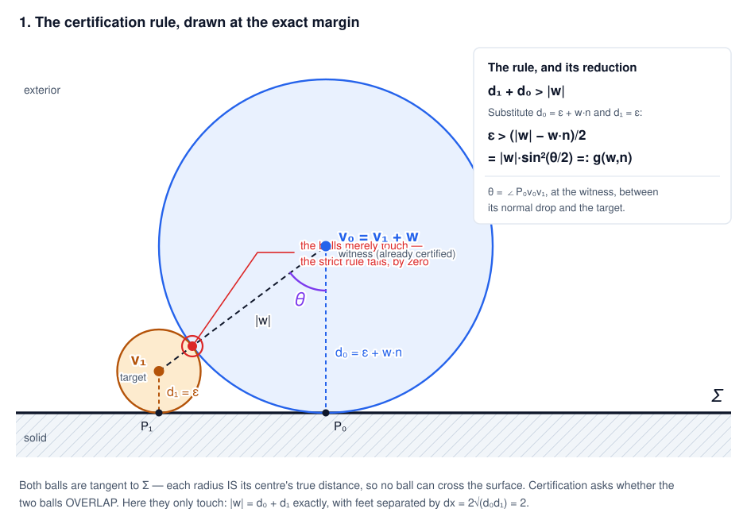
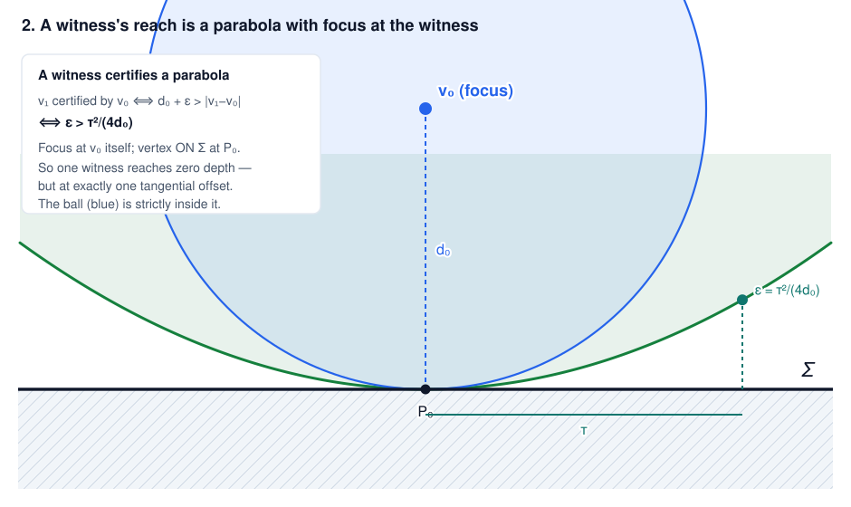
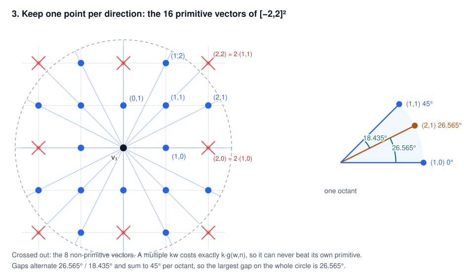
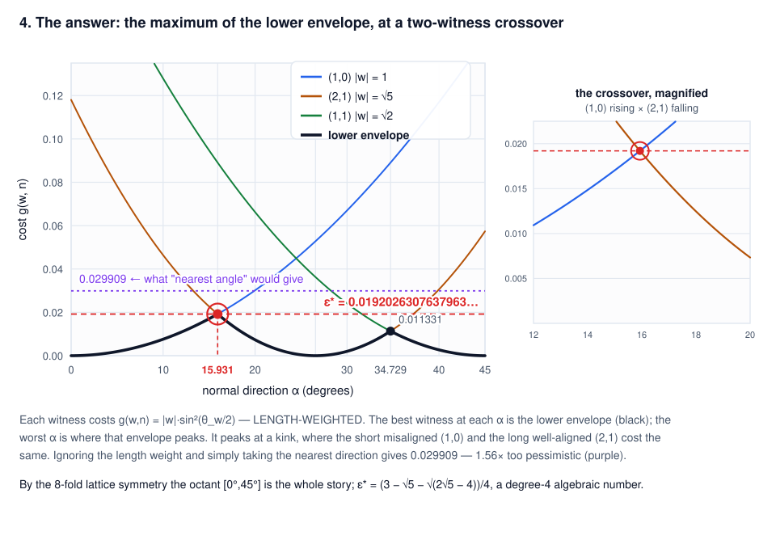
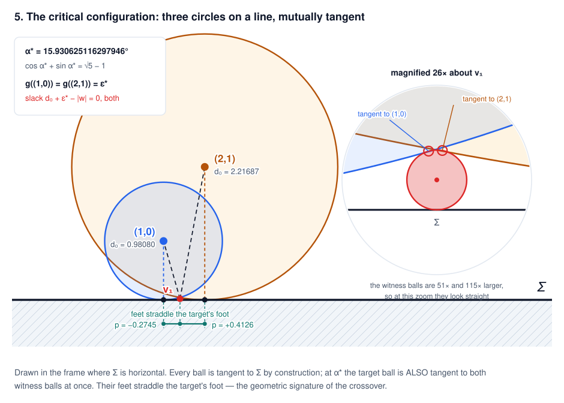
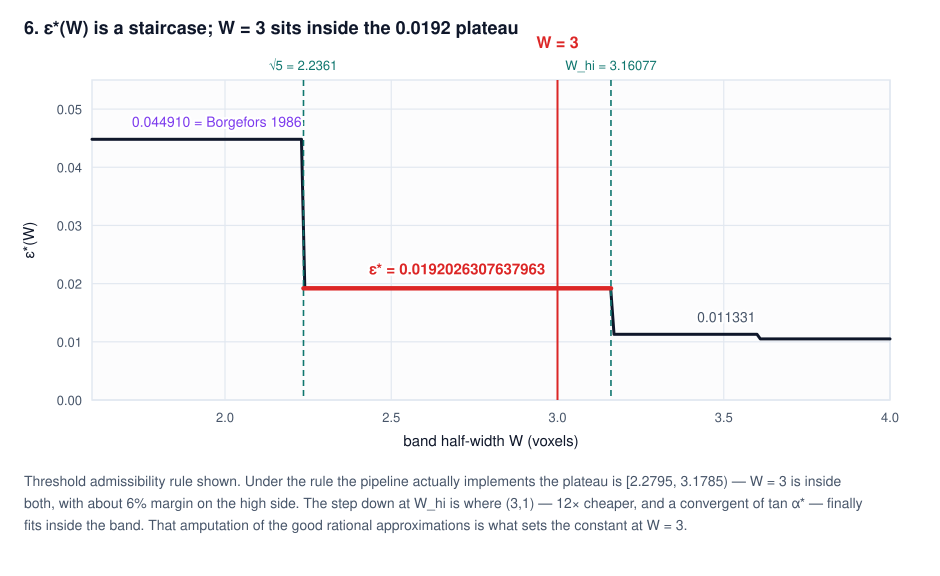
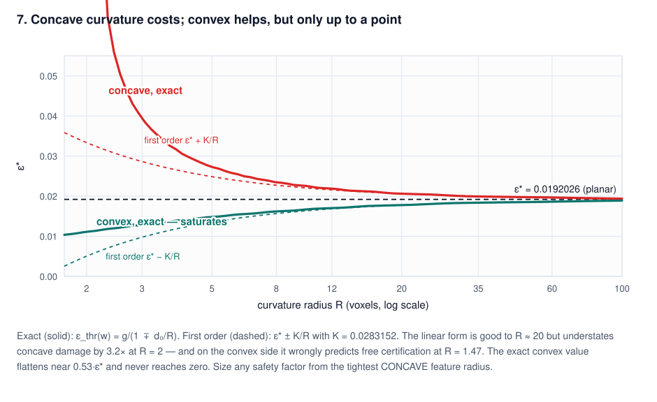

# How deep can an exterior voxel hide from a distance-field sign test?

**An exact answer in 2D, and what it means for the mesh→SDF pipeline.**

*Efty Sifakis. Working note, branch `new-distancing-approach`.*

---

This is a short, self-contained account of one result, written to be read. The full technical
document — with the complete proof, the referee findings, and everything that remains unproved — is
`LatticeCertificationGap.md`; the literature review is `LatticeCertificationGap_PriorArt.md`; the
verification scripts are in `scripts/distancing_experiments/lattice_gap/`. The 3D generalisation is
open and under separate investigation.

## The result, up front

For a straight interface on the unit lattice `Z²` with narrow-band half-width `W = 3`, the deepest
an exterior lattice point can lie and still escape certification by the
connected-components + pairwise-enrichment scheme is exactly

```
    ε*  =  (3 − √5 − √(2√5 − 4)) / 4
        =  0.019202630763796343828423710859901656903488071689…  voxels
```

an algebraic number of degree 4, with minimal polynomial `64x⁴ − 192x³ + 208x² − 56x + 1`. The bound
is **attained**, not merely approached: there is an explicit configuration — a straight interface at

```
    α*  =  15.930625116297946538…°,   characterised exactly by   cos α* + sin α* = √5 − 1
```

— that leaves a lattice point uncertified at exactly that depth. At `α*` two witnesses tie: the
short, poorly-aligned `(1,0)` and the long, well-aligned `(2,1)`.

For context: the barrier radius below which connected components alone can say nothing is
`√2/2 = 0.7071`. So enrichment reaches **36.8× deeper** than plain connected components, and the
guarantee is good to about `0.6%` of a voxel.

---

## 1. What is being certified, and why the rule looks like it does

The pipeline rasterises an unsigned distance field first and decides sign afterwards. A voxel whose
`UDF` exceeds the cell circumradius `r_d = √2/2` (in 2D; `√3/2` in 3D) cannot contain any surface,
so its sign is settled by connected components. Everything closer is a *barrier* voxel, and the
question is how to certify those.

The tool is a two-point rule. If `V₁` and `V₀` both lie in the surface's complement and

```
    d₁ + d₀  >  dist(V₁, V₀)          (strict)
```

then the whole segment between them is surface-free — the balls `B(V₁,d₁)` and `B(V₀,d₀)` overlap,
and neither can touch the surface because its radius *is* its centre's true distance. So the two
points share a sign. Given one certified exterior witness, the rule certifies the other point.



Put the target at the origin and the witness at integer offset `w`. The witness's depth is
`d₀ = ε + w·n`, and substituting into the rule collapses everything:

```
    ε + (ε + w·n) > |w|      ⟺      ε  >  (|w| − w·n)/2  =  |w|·sin²(θ_w/2)  =:  g(w, n)
```

where `θ_w` is the angle between the surface normal `n` and the offset `w` — equivalently, the angle
at the witness between its perpendicular drop to the surface and the segment to the target.

**The form on the right is the whole problem.** `g` is a *length-weighted* misalignment cost. A long
vector that points almost along the normal competes against a short vector that points badly, and
which one wins is not obvious. Everything that follows is a consequence of that weighting.

A witness is usable if it is itself certified, for which it suffices that it be non-barrier and
in-band. So

```
    ε*(n, W)  =  min over admissible w of g(w, n),        ε*(W) = max over unit n of ε*(n, W)
```

---

## 2. A single witness reaches a parabola

Before optimising, it is worth seeing what one witness can do. Fix a witness at depth `d₀` and ask
which points it certifies. The condition `d₀ + ε > |p − v₀|` rearranges to

```
    ε  >  τ² / (4 d₀)          τ = tangential offset from the witness's foot
```

— the interior of a **parabola whose focus is the witness itself** and whose directrix is the
surface pushed to the far side by `d₀`.



Two things follow immediately. The vertex sits *on* the surface, so a single witness reaches all the
way to zero depth — but at exactly one tangential offset. And the reach widens as `√d₀`, so deeper
witnesses are better, which is why the band width `W` will turn out to matter so much.

The parabola strictly contains the witness's own ball. That gap is the difference between asking
"is the target inside some ball?" (ball membership) and "does the target's ball overlap some ball?"
(the pairwise rule). The pairwise rule is exactly **twice** as strong, in any dimension and at any
`W`, because the usability window does not depend on which criterion is used.

---

## 3. Which witnesses can possibly matter

Two reductions cut an infinite lattice down to a handful of vectors.

**Non-primitive vectors are redundant.** For a multiple, `g(kw, n) = k·g(w, n)` exactly, so `kw` is
always `k` times more expensive than its own primitive. In `[−2,2]²` that removes precisely the
eight vectors `(±2,0)`, `(0,±2)`, `(±2,±2)`, leaving **16 primitive directions**.



**The search is finite.** Since `|w| = g + d₀` identically, an in-band witness with `g < G` obeys
`|w| < W + G`. At `W = 3` that is `|w| ≤ 3.0192`, i.e. **28 lattice vectors** — a finite,
exhaustively checkable set. (In 3D the same bound gives 122.)

The 16 directions have a striking structure: their angular gaps take only two values, `arctan(1/2) =
26.565°` and `45° − arctan(1/2) = 18.435°`, alternating, summing to `45°` per octant. So the largest
gap anywhere on the circle is `26.565°`, and every direction is within `13.283°` of an available
witness.

That last observation suggests an easy bound — just take the nearest direction. It gives
`√5·sin²(13.283°/2) = 0.029909`. **It is 1.56× too pessimistic**, and the reason is the length
weighting: at a wide-gap midpoint the two nearest directions are tied in *angle*, but one has
`|w| = 1` and the other `|w| = √5`.

---

## 4. The answer

Each witness contributes a cost curve `g(w, n(α)) = |w|(1 − cos(α − β_w))/2` over the octant. The
best available witness at each direction is the **lower envelope** of those curves, and the
worst-case direction is where that envelope peaks.



Only three witnesses per octant are ever needed — the orbit of `{(1,0), (2,1), (1,1)}` — and each is
admissible over the *entire* octant, not merely at the optimum. The envelope has two kinks, at the
two adjacent-pair crossovers:

| crossover | tie condition | direction | value |
|---|---|---|---|
| `(1,0) × (2,1)` | `nₓ + n_y = √5 − 1` | `15.930625°` | **`0.019202630763796`** |
| `(2,1) × (1,1)` | `nₓ = √5 − √2` | `34.729139°` | `0.011330789030059` |

The wide gap dominates, so `ε* = 0.0192026…`. Since `g` is affine in `n`, each tie is a *linear*
condition, and solving `nₓ + n_y = √5 − 1` together with `nₓ² + n_y² = 1` gives the surd directly —
no trigonometry required.

Both `(1,0)`/`(2,1)` and `(2,1)`/`(1,1)` are **unimodular pairs** (`det = 1`), i.e. Farey
neighbours. The octant partition is a Stern–Brocot bracketing of the direction. This is not a
coincidence and it is not new; see §8.

**Why the band cutoff is the whole story.** The continued fraction of `tan α*` is
`[0; 3, 1, 1, 72, …]`, and its convergent directions `(3,1)`, `(4,1)`, `(7,2)` cost
`1.5×10⁻³`, `1.1×10⁻³`, `1.2×10⁻⁷` — 12×, 17× and 160 000× cheaper than `ε*`. Every one of them is
out of band (`d₀ = 3.16`, `4.12`, `7.28`). **The constant at `W = 3` is set by the band amputating
the good rational approximations**, leaving two short vectors to fight it out. This is why an earlier
conjecture that the worst direction would be badly approximable (golden-ratio-like) was wrong:
Diophantine quality governs the `W → ∞` limit, not `W = 3`.

---

## 5. What the critical configuration looks like

Rotate so the interface is horizontal. Every ball is tangent to it by construction. At `α*` the
target ball is *additionally* tangent to both witness balls at once — three mutually tangent circles
sitting on a line.



| | `(1,0)` | `(2,1)` |
|---|---|---|
| `\|w\|` | `1` | `√5 = 2.236068` |
| `θ_w` | `15.930625°` | `10.634426°` |
| witness depth `d₀` | `0.980797369236` | `2.216865346736` |
| tangential offset `p` | `−0.274473` | `+0.412648` |
| slack `d₀ + ε* − \|w\|` | `0` exactly | `0` exactly |

The tie is exact in the field `Q(√(2√5−4))`, not numerical. The two feet **straddle** the target's
foot, spanning `0.687121 = cos α* − sin α*`; that opposition is the geometric signature of the
crossover.

The peak is a **kink**, with one-sided slopes `+0.1372` and `−0.2063` per radian. It is sharp: losing
1% of `ε*` takes only `0.08°` of misorientation. Any search on a grid coarser than that will
underestimate the worst case.

The nearest admissible runner-up is `(2,0)` at exactly `2ε* = 0.0384053` — a clean factor-2
isolation, so the answer is not delicately balanced against a third competitor.

---

## 6. How much of this depends on the band width

`ε*(W)` is a staircase. `W = 3` sits comfortably inside the `0.0192` plateau.



| plateau | `ε*` | set by |
|---|---|---|
| `W ∈ [1.42, √5)` | `0.044910139437773` | `(1,0) × (1,1)` crossover |
| `W ∈ [√5, 3.160768)` | **`0.019202630763796`** | `(1,0) × (2,1)` crossover |
| `W ∈ [3.160768, …)` | falls to `0.011330789` | `(3,1)` enters the band |

Under the admissibility rule the pipeline actually implements — a witness must be in band at the
*target's* depth, not at its own threshold — the plateau is instead `[2.279483, 3.178460)`. `W = 3`
is inside both, with about 6% margin on the high side. Below `W = 1 + r_d = 1.7071` the scheme
offers **no guarantee at all**: there is no non-barrier witness to start from.

The two rules are genuinely different, and conflating them is the easiest mistake to make here.
Growing `ε` pushes a witness out of the *top* of the band, so a witness's usable set is an interval
**bounded above**, and a union of such intervals need not be upward closed.

---

## 7. A flat interface is not the worst case

This is the practical caveat that matters most. For a circular interface of radius `R` the exact
threshold is available in closed form. Using the identity `g·d₀ = p²/4` (immediate from
`|w|² = (w·n)² + p²`):

```
    ε_thr(w)  =  g / (1 − d₀/R)     concave exterior
              =  g / (1 + d₀/R)     convex exterior
```

Curvature is a **pure multiplicative rescaling** of each witness's cost. To first order the penalty
is `p²/(4R)` — exactly half the sagitta of the arc spanning the witness's tangential offset. Concave
hurts because the witness sits on a chord and the surface bends toward it, shrinking its ball.



Two things the first-order form `ε* ± K/R` (`K = 0.0283152`) gets wrong, both in the unsafe
direction:

- It **understates concave damage** by 38% at `R = 3` and by a factor **3.2** at `R = 2`.
- It predicts that tight convex features certify for free at `R = 1.47`. They do not: the exact
  convex value **saturates near `0.53·ε*`** and never approaches zero.

Curvature also slides the critical direction — `15.93° → 16.55°` at `R = 8`, `18.82°` at `R = 3` — so
a search that assumes the planar critical angle will miss the worst case on curved geometry.

Rule of thumb, first order and therefore optimistic:

| tolerated excess over `ε*` | required concave radius |
|---|---|
| `+10%` | `> 14.7` voxels |
| `+25%` | `>  5.9` voxels |
| `+50%` | `>  2.9` voxels |

In 3D the penalty becomes `(p·H·p)/4` with `H` the second fundamental form. A concave sphere
dominates a cylinder or a saddle pointwise at the same maximum principal curvature, so the concave
sphere should be the worst case among surfaces of bounded curvature — flagged as expected rather
than proved, since the argument ignores that a changed depth also changes admissibility.

---

## 8. Prior art, honestly

**The machinery is classical.** Decomposing directions into angular sectors indexed by the
Farey/Stern–Brocot ordering of primitive lattice vectors, reducing each sector to its two generating
vectors, and locating the optimum at an equal-cost crossover is textbook chamfer-mask and
digital-medial-axis material (Montanari 1968; Borgefors 1986; Thiel–Montanvert 1992; Remy–Thiel
2000; Hulin–Thiel 2009). Our 16 directions are the Farey sequence `F₂` under the dihedral group.

**One of our constants is a rediscovery and must be attributed.** The `W ∈ [1.42, √5)` plateau value
`0.0449101394377726` is *exactly* Borgefors 1986, Eq. (18) — same constant to `5.6×10⁻¹⁷`, same
critical angles `24.5°/65.5°`, and her optimal `3×3` chamfer weights `0.95509`, `1.36930` are exactly
our witness depths. The identity is an accident of the `3×3` case and breaks at `5×5`; her
`5×5` value `0.019579` is close to, but not, our `0.0192026`.

**The `W = 3` constant and the functional appear to be new.** Every optimality criterion in that
literature is multiplicative or relative; ours is a worst-case **additive** deficiency subject to a
budget on a *projected* quantity (`(|w| + w·n)/2 ≤ W`) rather than on neighbourhood size. That
combination was not found. Confidence: **medium** — the search was cut short and never reached
MathSciNet/zbMATH or venue-scoped indexes, so read "not found" as "not exhaustively searched for".

Two by-products worth keeping: a single closed form generates the whole plateau family (tying pair
always `{(1,0), (p,1)}`), and `2ε*` turns out to be the smallest uniform subtraction from exact
Euclidean weights that makes a chamfer norm a global under-estimate.

---

## 9. What this means for the implementation

1. **Use a guarded predicate.** With plain doubles, `UDF(A) + UDF(B) > dist(A,B)` **certifies points
   on the wrong side** whenever the normal is parallel to an integer vector — i.e. at exactly the
   axis-aligned and diagonal orientations that dominate real content, where the comparison is an
   exact tie and rounding breaks it the wrong way. Observed directly: at `45°`, `A = (−10,12)`,
   `B = (−12,10)`, double rounding produced a margin of `+4.4×10⁻¹⁶` and certified an interior point.
   Use `UDF(A) + UDF(B) − dist > tol`; the cost is a conservative `tol/2` shift.
2. **Size safety factors from the tightest concave feature**, not from the planar constant.
3. **Do not hard-code the 15-digit decimal as a bound.** `0.019202630763796` lies *below* `ε*`, so
   the inequality is false on a window of width `4.2×10⁻¹⁵` rad around `α*`. Round *up* to
   `0.0192026307637964`, or use the surd.
4. **Check `W` against the plateau.** Below `W = 2.2795` the constant jumps by `2.34×`; below
   `1.7071` there is no guarantee at all.
5. **Separate failure mode:** exterior pockets with in-radius at or below `r_d` have no non-barrier
   seed, so nothing gets certified regardless of the constant.

---

## 10. Status, and what a reviewer should push on

**Proved:** the upper bound over all directions; tightness at `α*` (via the finiteness bound plus
exhaustive enumeration of 28 vectors, with the tie exact in `Q(√(2√5−4))`); the closed forms and the
minimal polynomial; the threshold-rule plateau endpoints.

**Certified numerically, not proved:** the exact-rule plateau endpoints; that the certified set is
upward closed in `ε` at `W = 3` (verified on 90 001 directions with zero exceptions — but
certification is *not* monotone in `ε` in general, so this genuinely needs an argument).

**Known false:** that a straight interface is the worst case.

**Independent confirmation.** Seven strategies — an end-to-end simulation that never uses the reduced
formula, a closed-form critical-angle certificate, hill climbing with 4000 restarts, a 4-million
direction sweep, exact rational probes to `10⁻⁴⁰`, and brute force on the original problem — all
agree, and nothing anywhere exceeded `ε*`. Three adversarial referees re-implemented the checks from
scratch; their findings and dispositions are tabulated in §3.9 of the technical document.

**Where I would push first, as a reviewer:** the upward-closedness gap in §10; whether the concave
sphere really is the 3D worst case once admissibility effects are included; and whether the prior-art
absence claim survives a proper database search.

---

## Reproducing this

```bash
cd scripts/distancing_experiments/lattice_gap
python3 syn_v1.py     # five closed forms agree to 70 digits; the quartic; alpha*
python3 syn_v2.py     # exhaustive tightness at n*; finiteness bound; three-arc covering
python3 curv2.py      # the exact curvature law and the tables of section 7
python3 e2e_sim.py    # end-to-end pipeline simulation, never using the reduced formula
python3 figs.py       # regenerates every figure in this note, into ../../figures/
```

Pure Python 3, no third-party dependencies. See the README in that directory for the full inventory.
